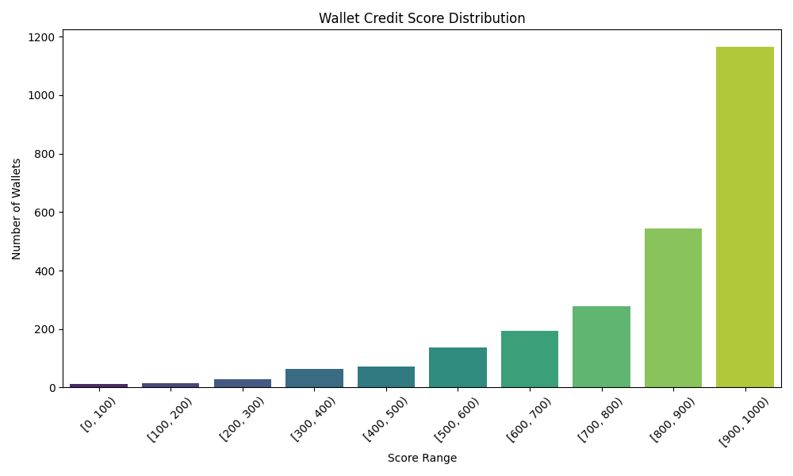

# Wallet Credit Score Analysis

This document summarizes the behavior patterns and score distribution of wallets interacting with the Aave V2 protocol, based on transaction-level data.

---

## 📊 Score Distribution

Wallet credit scores are assigned on a scale of **0 to 1000**, where:

- **Higher scores (800–1000)** indicate responsible and consistent protocol usage.
- **Lower scores (0–200)** reflect risk-prone or suspicious behavior.

The chart below illustrates the distribution of scores across 100-point buckets:

---

## 📌 Behavior of Wallets by Score Range

### ✅ **High-Scoring Wallets (800–1000)**  
These wallets typically exhibit:
- A strong **repayment ratio** (close to or equal to 1.0).
- Low or **no liquidation events**.
- Healthy **borrow-to-deposit** ratio (≤1.0), indicating prudent borrowing.
- Regular and long-term engagement (many active days).
- Well-balanced usage of protocol features (deposit, borrow, repay, redeem).

### ⚠️ **Low-Scoring Wallets (0–200)**
These wallets often show:
- Frequent **liquidation calls**.
- Very low or zero **repayments** after borrowing.
- **High borrow-to-deposit** ratios, indicating aggressive leverage or risky usage.
- Sudden, short bursts of interaction (suggesting bot-like behavior).
- Unusual usage patterns like depositing and withdrawing rapidly.

---

## 📈 Summary Statistics

| Metric              | Value      |
|---------------------|------------|
| Mean Credit Score   | 868.80     |
| Median Credit Score | 945.00     |
| Std. Deviation      | 177.87     |
| Wallets Scored      | 3, 497     |

## 🧠 Observations & Insights

- **Repayment behavior** is the strongest positive predictor of high scores.
- Wallets that were **liquidated more than once** were disproportionately in the lowest score bucket.
- The model flagged wallets with **only borrow and no repay activity** as highly risky.
- Most users with balanced usage of the protocol fell in the 500–800 range.

---

## 🔄 Future Improvements

- Incorporate **time-weighted behavior** (recent vs old actions).
- Add **asset type sensitivity** (e.g., risky asset classes vs stablecoins).
- Flag wallets that use **flash loans** or exhibit MEV-like patterns.

---
